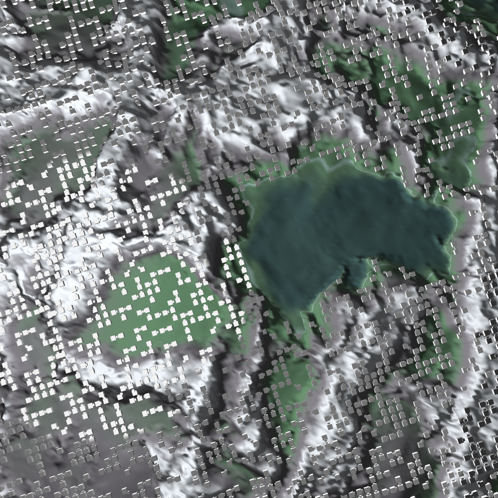

# GENERATIONS


<table><tr>
<td valign="middle"></td>
<td valign="middle"></td>
<td valign="middle"></td>
</tr></table>

GENERATIONS is a Vulkan-native simulation runtime (CAPITAL Engine) focused on GPU-first simulation + rendering.
The project currently runs a Conway-style cellular simulation on terrain with compute/graphics staging and runtime-configurable pipeline execution.



## Current status (February 2026)

- Linux build is green with CMake (`cmake --preset dev && cmake --build --preset dev`)
- Runtime launch is verified from root via `./run.sh`
- Scene setup is authored in C++ via `src/world/SceneConfig.*`
- Runtime config registry/env parsing lives in `src/world/RuntimeConfig.*`
- Resource/world runtime objects are in `src/vulkan_resources/*`
- Vulkan pipeline + frame orchestration are in `src/vulkan_pipelines/*`

## Source layout (current)

```text
src/
├── main.cpp
├── control/           # window, timer, GUI/stage-strip controls
├── engine/            # CAPITAL Engine lifecycle + logging
├── library/           # path helpers, screenshots, utility I/O
├── vulkan_resources/  # World + Resources + generated shader interface
├── vulkan_base/       # low-level Vulkan wrappers and primitives
├── vulkan_mechanics/  # device/swapchain orchestration
├── vulkan_pipelines/  # pipeline config + frame command recording
└── world/             # scene defaults, runtime config, camera, geometry, terrain
```

## Build and run (Linux)

### Requirements

- CMake >= 3.20
- GCC 12 / G++ 12 (default in `CMakeLists.txt`)
- Vulkan SDK 1.3.x
- GLFW 3.3.x (`glfw`)
- Python 3
- `glslangValidator` in `PATH`

### Commands

```bash
cmake --preset dev
cmake --build --preset dev
./run.sh
```

This keeps generated build/runtime files under `out/` while still running commands from repository root.

Direct binary launch remains available:

```bash
./out/bin/CapitalEngine
```

## Runtime modes and flags

- `CE_SCRIPT_ONLY=1`: apply scene config only, skip engine loop
- `CE_WORKLOAD_PRESET=default|compute_only`: select workload strategy
- `CE_COMPUTE_CHAIN=<csv>`: set compute pipeline order
- `CE_RENDER_STAGE=<n>`: restrict stage selection via scene config
- `CE_SCENE_PRECOMPUTE=<csv>`: override precompute graph nodes explicitly
- `CE_SCENE_GRAPHICS=<csv>`: override graphics graph nodes explicitly
- `CE_SCENE_POSTCOMPUTE=<csv>`: override postcompute graph nodes explicitly
- `CE_STARTUP_SCREENSHOT=1`: capture startup screenshot
- `CE_GPU_TRACE=1`: verbose GPU trace logging
- `CE_CAMERA_TUNING=1`: enable camera tuning controls
- `NO_COLOR=1`: disable ANSI-colored logs

Truthy env values are centrally parsed by `CE::Runtime::env_truthy` and accept `1`, `true`, `on` (case-insensitive).

Scene defaults are intentionally centralized in `src/world/SceneConfig.cpp`; `RuntimeConfig` now acts as the mutable runtime registry rather than owning scene default values.
`SceneConfig` also centralizes assembly metadata (`resources`, `shader_binaries`) so pipeline graph, resource IO, and shader source→binary routing are maintained in one place.

## Build and run (Windows)

Use `GENERATIONS.sln` (Visual Studio 2022, v143 toolset) with Vulkan SDK + GLFW configured.

## Developer checks

```bash
python3 assets/tools/check_folder_dependencies.py
```

```bash
find src -type f \( -name "*.cpp" -o -name "*.h" \) -print0 | xargs -0 clang-format -i
```

## Thanks

Big thanks to everyone contributing through GitHub issues, reviews, and code:

- Jakob Povel
- Johannes Unterguggenberger (@johannes.unterguggenberger)
- Jos Onokiewicz (@jos.onokiewicz)

And gratitude to the open graphics ecosystem this project learns from and builds on, especially:

- https://vulkan-tutorial.com/
- https://github.com/SaschaWillems/Vulkan
- Khronos Vulkan documentation and tooling

