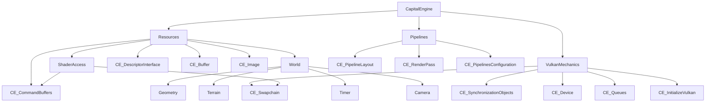

# Class and Function Connection Map

This map is generated from current headers under src.
It is grouped by module so dependencies are easy to follow.

## High-level dependency map

## App layer

### CapitalEngine (src/app/CapitalEngine.h)
Functions
- CapitalEngine()
- ~CapitalEngine()
- main_loop()
- draw_frame()
- take_screenshot()

Direct owns/uses
- VulkanMechanics
- Resources
- Pipelines

## Platform layer

### Window (src/platform/Window.h)
Nested types
- DisplayConfiguration
- Mouse
- Mouse::Button

Functions
- static get()
- poll_input()
- consume_screenshot_pressed()
- is_escape_pressed() const
- set_mouse() [private]
- init_window() [private]
- window_resize(...) [private static]

### ValidationLayers (src/platform/ValidationLayers.h)
Functions
- ValidationLayers()
- ~ValidationLayers()
- setup_debug_messenger(...)
- populate_debug_messenger_create_info(...)
- check_validation_layer_support()
- destroy_debug_utils_messenger_ext(...)
- create_debug_utils_messenger_ext(...) [private]
- log_validation_message(...) [private static]
- debug_callback(...) [private static]

## Core and IO

### Timer (src/core/Timer.h)
Functions
- Timer(float)
- ~Timer()
- run()

### Log namespace (src/core/Log.h)
Type
- Style

Key functions
- text(...)
- log_title(), log_footer()
- skip_logging(...), emit_line(...), flush_repeated_line()
- measure_elapsed_time()
- function_name(...)
- get_*_string(...) helpers

### Lib namespace (src/io/Library.h)
Type
- vec2_uint_fast16_t

Functions
- generate_random_values(...)
- low_frequency_oscillator(...)
- smoothstep(...)
- upper_to_lower_case(...)
- path(...)
- if_shader_compile(...)

### Screenshot (src/io/Screenshot.h)
Functions
- capture(...)
- copy_image_to_buffer(...) [private]
- save_buffer_to_file(...) [private]

## World layer

### Terrain (src/world/Terrain.h)
Type
- Config

Functions
- Terrain(const Config&)
- ~Terrain()
- generate_perlin_grid()
- linear_interpolation_function(...)

### Camera (src/world/Camera.h)
Types
- Mode enum
- ModelViewProjection
- Light

Functions
- toggle_mode()
- set_mode(...), get_mode() const
- configure_arcball(...)
- configure_arcball_multipliers(...)
- set_arcball_horizon_lock(...), get_arcball_horizon_lock() const
- set_model(), set_view(), set_projection(...)
- apply_panning_mode(...) [private]
- apply_arcball_mode(...) [private]
- map_cursor_to_arcball(...) [private]
- sync_arcball_from_current_view(...) [private]
- update() [private]

### Geometry model (src/world/Geometry.h)
#### Vertex
- get_binding_description() static
- get_attribute_description() static

#### Geometry : Vertex
- Geometry(GEOMETRY_SHAPE)
- ~Geometry()
- get_binding_description() static
- get_attribute_description() static
- create_buffers(...)
- add_vertex_position(...)
- calculate_normals()
- load_model(...) [private]

#### Shape : Geometry
- Shape(...)
- ~Shape()

### World (src/world/World.h)
Types
- Cell
- UniformBufferObject
- Grid : Geometry

Functions
- World(...)
- ~World()
- Cell::get_binding_description() static
- Cell::get_attribute_description() static
- Grid::Grid(...)
- Grid::get_attribute_description() static
- Grid::set_cells_alive_randomly(...) [private]

Owns
- _grid, _rectangle, _cube
- _ubo, _camera, _time

## Render layer

### VulkanMechanics (src/render/Mechanics.h)
Nested classes
- Device : CE::Device
- SynchronizationObjects : CE::SynchronizationObjects
- Swapchain : CE::Swapchain

Functions
- VulkanMechanics()
- ~VulkanMechanics()
- Swapchain::initialize(...)
- Swapchain::recreate(...)

Public state used by app
- init_vulkan, queues, main_device, swapchain, sync_objects

### ShaderAccess (src/render/ShaderAccess.h)
Nested class
- CommandResources : CE::CommandBuffers

Functions
- CommandResources(...)
- record_compute_command_buffer(...)
- record_graphics_command_buffer(...)

### Resources (src/render/Resources.h)
Nested classes
- UniformBuffer : CE::Descriptor
- StorageBuffer : CE::Descriptor
- ImageSampler : CE::Descriptor
- StorageImage : CE::Descriptor

Functions
- Resources(...)
- ~Resources()
- UniformBuffer::update(...)
- UniformBuffer::create_buffer() [private]
- UniformBuffer::create_descriptor_write(...) [private]
- StorageBuffer::create(...) [private]
- StorageBuffer::create_descriptor_write(...) [private]
- ImageSampler::create_descriptor_write(...) [private]
- StorageImage::create_descriptor_write(...)

Core owned objects
- commands, command_interface, push_constant
- world
- descriptor_interface
- depth_image, msaa_image
- uniform, shader_storage, sampler, storage_image

### Pipelines (src/render/Pipelines.h)
Nested classes
- ComputeLayout : CE::PipelineLayout
- GraphicsLayout : CE::PipelineLayout
- Render : CE::RenderPass
- Configuration : CE::PipelinesConfiguration

Functions
- Pipelines(...)
- ~Pipelines()

Owns
- compute, graphics, render, config

## Base Vulkan layer (CE namespace)

### Queues (src/base/VulkanDevice.h)
Type
- FamilyIndices

Functions
- find_queue_families(...)

### InitializeVulkan (src/base/VulkanDevice.h)
Functions
- InitializeVulkan()
- ~InitializeVulkan()
- create_instance() [private]
- create_surface(...) [private]
- get_required_extensions() const [private]

### Device (src/base/VulkanDevice.h)
Functions
- Device()
- ~Device()
- pick_physical_device(...) [protected]
- create_logical_device(...) [protected]
- destroy_device() [protected]
- fill_queue_create_infos(...) [private]
- get_device_create_info(...) [private]
- set_validation_layers(...) [private]
- fill_devices(...) [private]
- is_device_suitable(...) [private]
- get_max_usable_sample_count() [private]
- check_device_extension_support(...) [private]

### CommandBuffers (src/base/VulkanSync.h)
Functions
- ~CommandBuffers()
- begin_singular_commands(...) static
- end_singular_commands(...) static
- record_compute_command_buffer(...) pure virtual
- record_graphics_command_buffer(...) pure virtual
- create_pool(...) [protected]
- create_buffers(...) [protected]

### CommandInterface (src/base/VulkanSync.h)
Function
- CommandInterface(...)

### SynchronizationObjects (src/base/VulkanSync.h)
Functions
- SynchronizationObjects()
- ~SynchronizationObjects()
- create() [protected]
- destroy() const [private]

### Swapchain (src/base/VulkanSync.h)
Type
- SupportDetails

Functions
- Swapchain()
- ~Swapchain()
- check_support(...)
- create(...) [protected]
- recreate(...) [protected]
- destroy() [private]
- pick_surface_format(...) [private]
- pick_present_mode(...) [private]
- pick_extent(...) [private]
- get_image_count(...) [private]

### Buffer (src/base/VulkanResources.h)
Functions
- ~Buffer()
- create(...) static
- copy(...) static
- copy_to_image(...) static

### Image (src/base/VulkanResources.h)
Functions
- Image()
- Image(IMAGE_RESOURCE_TYPES,...)
- Image(const std::string&)
- ~Image()
- create(...)
- recreate()
- create_view(...)
- create_sampler()
- create_resources(...)
- transition_layout(...)
- load_texture(...)
- find_depth_format() static
- find_supported_format(...) static [protected]
- destroy_vulkan_images() const [private]

### DescriptorInterface (src/base/VulkanDescriptor.h)
Functions
- DescriptorInterface()
- ~DescriptorInterface()
- initialize_sets()
- update_sets()
- create_set_layout() [private]
- create_pool() [private]
- allocate_sets() [private]

### Descriptor (src/base/VulkanDescriptor.h)
Type
- DescriptorInformation

Functions
- Descriptor()
- ~Descriptor()

### PushConstants (src/base/VulkanPipeline.h)
Functions
- PushConstants(...)
- ~PushConstants()
- set_data(...)

### PipelineLayout (src/base/VulkanPipeline.h)
Functions
- ~PipelineLayout()
- create_layout(...)
- create_layout(..., push_constants)

### RenderPass (src/base/VulkanPipeline.h)
Functions
- ~RenderPass()
- create(...)
- create_framebuffers(...)

### PipelinesConfiguration (src/base/VulkanPipeline.h)
Nested types
- Graphics
- Compute

Functions
- ~PipelinesConfiguration()
- create_pipelines(...)
- get_pipeline_object_by_name(...)
- get_work_groups_by_name(...)
- compile_shaders() [protected]
- get_pipeline_shaders_by_name(...) [private]
- set_shader_stages(...) [private]
- read_shader_file(...) [private]
- create_shader_modules(...) [private]
- destroy_shader_modules() [private]

## Connection notes
- CapitalEngine coordinates frame flow across VulkanMechanics, Resources, and Pipelines.
- Resources is the main bridge between World data and GPU descriptors/buffers/images.
- ShaderAccess implements command recording and consumes both Resources and Pipelines.
- Base CE classes expose low-level Vulkan primitives used by all higher layers.

## Important note about duplicate headers
There are top-level duplicates and render-scoped headers:
- src/Pipelines.h and src/render/Pipelines.h
- src/Resources.h and src/render/Resources.h

The active runtime wiring is in the render-scoped versions used by app and render cpp files.
